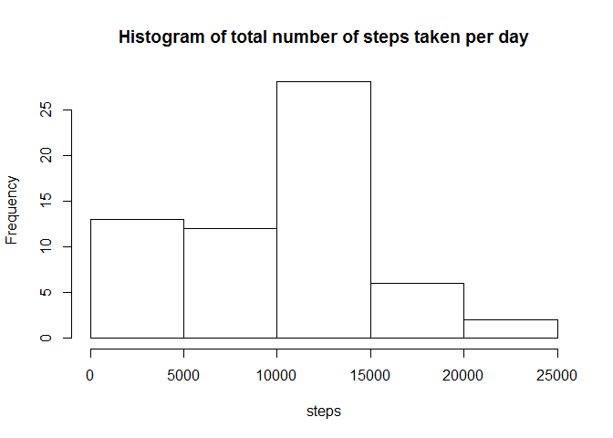
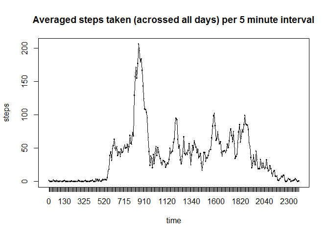
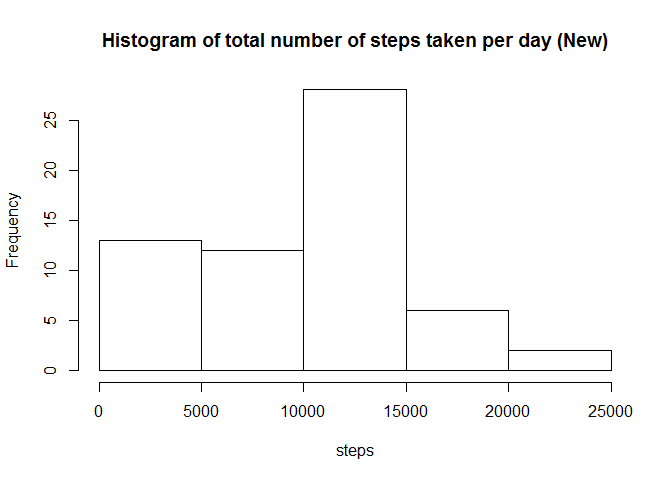
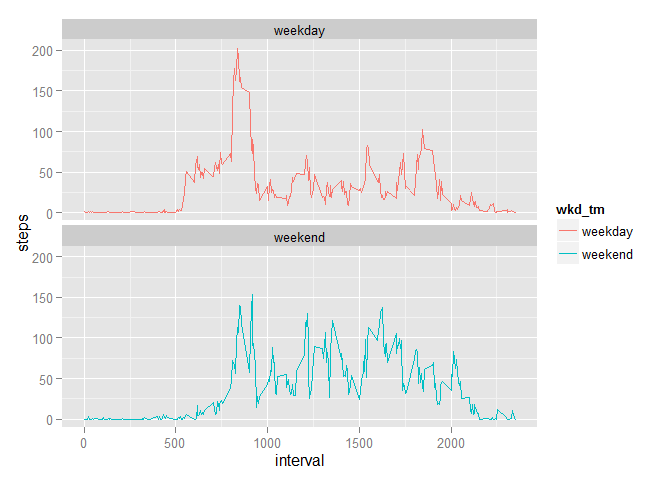

# Reproducible Research: Peer Assessment 1
**Yongdan Tang**


*Global Option is set as echo = TRUE so all codes should be visible. Results are shown in markup brackets so they can be differentiated as well.* 


```r
require(knitr)
```

```
## Loading required package: knitr
```

```r
opts_chunk$set(echo = TRUE, results = "markup")
```


## Loading and preprocessing the data
1. set working directory properly
2. download the file from the coursera source url *the url need to be http instead of https*
3. unzip the file into the same directory and read it into R as a temp data.frame
4. format this temp data.frame as tbl_df using dplyr package for following use
5. this dataset has  17,568 observations and 3 variables


```r
wd_url <- "C:/Users/Yong/RepData_Assessment1/RepData_PeerAssessment1"
setwd(wd_url)

download.file("http://d396qusza40orc.cloudfront.net/repdata%2Fdata%2Factivity.zip", "activity.zip")
unzip("activity.zip")
temp <- read.csv(file = "activity.csv", na.strings = "NA")

library(dplyr)
```

```
## 
## Attaching package: 'dplyr'
## 
## The following object is masked from 'package:stats':
## 
##     filter
## 
## The following objects are masked from 'package:base':
## 
##     intersect, setdiff, setequal, union
```

```r
temp <- tbl_df(temp)
temp$date <- as.Date(temp$date)
print(temp)
```

```
## Source: local data frame [17,568 x 3]
## 
##    steps       date interval
## 1     NA 2012-10-01        0
## 2     NA 2012-10-01        5
## 3     NA 2012-10-01       10
## 4     NA 2012-10-01       15
## 5     NA 2012-10-01       20
## 6     NA 2012-10-01       25
## 7     NA 2012-10-01       30
## 8     NA 2012-10-01       35
## 9     NA 2012-10-01       40
## 10    NA 2012-10-01       45
## ..   ...        ...      ...
```


## What is mean total number of steps taken per day?
For this part of the assignment, ignore the missing values in the dataset.

1. Calculate the total number of steps taken per day. Group the dataset by date, then use summarise() function to calculate the total steps per day. 
2. Plot the histogram of total steps per day using hist() funciton


```r
per_day_steps <- summarise(group_by(temp, date), 
                           steps = sum(steps, na.rm = TRUE))

with(per_day_steps, hist(steps,
                         main = "Histogram of total number of steps taken per day", 
                         xlab = "steps"
                         ))
```

 


3. Calculate and report the mean and median of the total number of steps taken per day and report them afterwards


```r
mean_steps <- mean(per_day_steps$steps, na.rm = TRUE)
median_steps <- median(per_day_steps$steps, na.rm = TRUE)

print(mean_steps)
```

```
## [1] 9354.23
```

```r
print(median_steps)
```

```
## [1] 10395
```

**The mean total steps taken per day is 9354.2295082.**
**The median total steps taken per day is 10395.**


## What is the average daily activity pattern?

1. Make a time series plot (i.e. type = "l") of the 5-minute interval (x-axis) and the average number of steps taken, averaged across all days (y-axis).
- make another factor variable called "time" as we know the 5-minute interval represents certain time in a day
- Calculate the averaged numbers of steps taken averaged across all days for the 5-minute interval using summarise() function group the steps by time
- Plot time-series steps using base plotting system. *since time is a factor variable, plot() function will call plot.factor() function which results in a scatter plot. calling lines() function again to connect the dots.*


```r
temp$time <- as.factor(temp$interval)
per_interval_avg_steps <- summarise(group_by(temp, time),
                                    steps = mean(steps, na.rm = TRUE))


with(per_interval_avg_steps, plot(time, 
                                  steps, 
                                  type = "n",
                                  main = "Averaged steps taken (acrossed all days) per 5 minute interval",
                                  xlab = "time",
                                  ylab = "steps"))
with(per_interval_avg_steps, lines(time, steps))
```

 


2. Which 5-minute interval, on average across all the days in the dataset, contains the maximum number of steps?
- use the filter() function to extract the row which contains the maximum steps
- print the max result


```r
max <- filter(per_interval_avg_steps, steps == max(steps))
print(max)
```

```
## Source: local data frame [1 x 2]
## 
##   time    steps
## 1  835 206.1698
```
**On average across all the days in the dataset, the 5-minute interval that contains the maximum number of steps is 835.**
**The 5-minute interval 835 contains 206.1698113 of steps.**


## Imputing missing values
1. Calculate and report the total number of missing values in the dataset (i.e. the total number of rows with NAs)
- subset the dataset using is.na() function
- count the number of missing values using nrow() function then print the number of NAs  


```r
NA_data <- temp[is.na(temp$steps),]
NA_count <- nrow(NA_data)
print(NA_count)
```

```
## [1] 2304
```
**The total number of NAs in the dataset is 2304.**

2. Devise a strategy for filling in all of the missing values in the dataset. The strategy does not need to be sophisticated. For example, you could use the mean/median for that day, or the mean for that 5-minute interval, etc.
3. Create a new dataset that is equal to the original dataset but with the missing data filled in.
- separate the valid and NA data into two dataset from the original
- load the join() funciton in plyr package to fill in the NA values with mean steps taken per day. *taking only 2:5 columns to remove the column with NAs*
- merge the valid_data with filled dataset to form a new "finished" dataset, by their common variable names
- checking the dimension of the finished dataset to ensure match with original size of the dataset


```r
valid_data <- temp[!is.na(temp$steps),]
library(plyr)
```

```
## -------------------------------------------------------------------------
## You have loaded plyr after dplyr - this is likely to cause problems.
## If you need functions from both plyr and dplyr, please load plyr first, then dplyr:
## library(plyr); library(dplyr)
## -------------------------------------------------------------------------
## 
## Attaching package: 'plyr'
## 
## The following objects are masked from 'package:dplyr':
## 
##     arrange, count, desc, failwith, id, mutate, rename, summarise,
##     summarize
```

```r
filled <- join(NA_data, per_day_steps, by = "date")[,2:5]
finished <- merge(valid_data, filled, all = TRUE)
finished <- arrange(finished, date, interval, time)
dim(finished)
```

```
## [1] 17568     4
```


4. Make a histogram of the total number of steps taken each day and Calculate and report the mean and median total number of steps taken per day. Do these values differ from the estimates from the first part of the assignment? What is the impact of imputing missing data on the estimates of the total daily number of steps?
- calculate the total number of steps taken each day with the new dataset. *somehow I couldn't get it right using summarise() and group_by() function this time. I guess something is wrong with my date variable but I had no time to dig further into this*
- plot the historgram of steps taken each day
- calculate and report the mean and median steps taken per day again.


```r
per_day_steps_new <- aggregate(steps~date, data = finished, FUN = sum)

with(per_day_steps_new, hist(steps,
                             main = "Histogram of total number of steps taken per day (New)",
                             xlab = "steps"
                             ))
```

 

```r
mean_steps_new <- mean(per_day_steps_new$steps, na.rm = TRUE)
median_steps_new <- median(per_day_steps_new$steps, na.rm = TRUE)

print(mean_steps_new)
```

```
## [1] 9354.23
```

```r
print(median_steps_new)
```

```
## [1] 10395
```
**The new mean total steps taken per day is 9354.2295082.**
**The new median total steps taken per day is 10395.**

**The values are the same as the results from the previous dataset. Imputing missing data does not seem to have impact on the results, mainly because the imputed values are all ZERO.**


## Are there differences in activity patterns between weekdays and weekends?
Use the dataset with the filled-in missing values for this part.

1. Create a new factor variable in the dataset with two levels - "weekday" and "weekend" indicating whether a given date is a weekday or weekend day.
- create a variable called "day" with the weekdays() function in the finished new dataset
- create another variable called "wkd_tm" to differentiate weekday or weekend


```r
finished$date <- as.Date(finished$date)
finished$day <- weekdays(finished$date)
finished$wkd_tm <- ifelse(finished$day %in% c("Saturday", "Sunday"), "weekend", "weekday")
```


2. Make a panel plot containing a time series plot (i.e. type = "l") of the 5-minute interval (x-axis) and the average number of steps taken, averaged across all weekday days or weekend days (y-axis). See the README file in the GitHub repository to see an example of what this plot should look like using simulated data.
- calculate the average number of steps taken across all weekend and weekday days, using the aggregate() function
- make a 2 row 1 column panel plot using ggplot2 system and differentiate the weekday and weekend average number of steps (y axis) with color vs. interval (x axis)


```r
per_interval_steps_new <- aggregate(steps ~ interval + wkd_tm, data = finished, FUN = mean, na.rm = TRUE)

library(ggplot2)
g <- ggplot(per_interval_steps_new, aes(interval, steps))
p <- g + geom_line(aes(color = wkd_tm)) + facet_wrap(~wkd_tm, nrow = 2, ncol = 1)
print(p)
```

 

